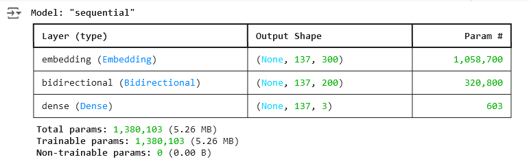
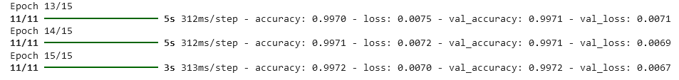
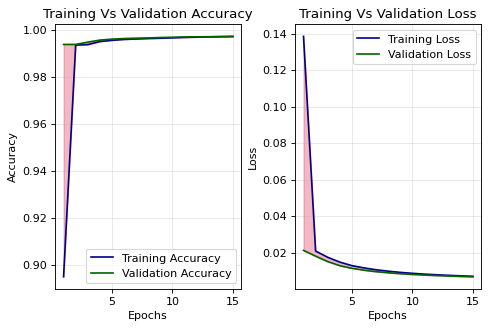
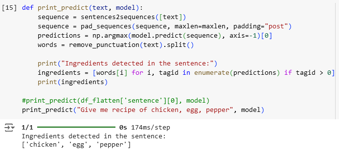

# Sisain 
# Sisain - Transform what you have into What you Crave !

## Overview
This branch contain the notebook (.ipynb) for training the model and the model API

## Libraries

- Pandas
- Sklearn
- Numpy
- Tensorflow & Keras
- FastAPI
- Seqeval (Model Evaluation) [🔗](https://github.com/chakki-works/seqeval)

## About the Model


### Dataset

The dataset we use is [recipe-dataset-over-2m](https://kaggle.com/wilmerarltstrmberg/recipe-dataset-over-2m). And we transform it into [BIO-tagging](https://en.wikipedia.org/wiki/Inside%E2%80%93outside%E2%80%93beginning_(tagging)) format. Then we split the dataset for training and validation.

### Architecture

Our model uses Named Entity Recognition (NER) for ingredient detection. It starts with an Embedding Layer to represent words as vectors, followed by a BiLSTM Layer to understand context from both directions. The Dense Layer then classifies tokens as B-FOOD, I-FOOD, or O for accurate ingredient identification.



### Eval

Our model achived around 99.72% accuracy for both training and validation. And 0.007 loss for training and for validation loss, it's 0.0067





We use seqeval to evaluate our model. We found out that the model has the `precision` of 0.69, `recall` of 0.75 and `f1-score` of 0.72

```
              precision    recall  f1-score   support

        FOOD       0.69      0.75      0.72      3569

   micro avg       0.69      0.75      0.72      3569
   macro avg       0.69      0.75      0.72      3569
weighted avg       0.69      0.75      0.72      3569
```

### In action

This is a demo of our model



## Setup and Installation

1. Clone repository
```shell
git clone https://github.com/jazhardcore7/sisain
cd Sisain
```

2. Enter Virtual Env and Install Dependencies
```shell
pipenv shell
pipenv install
```

3. Run app
```shell
uvicorn app:app --host 0.0.0.0 --port 8000
```
